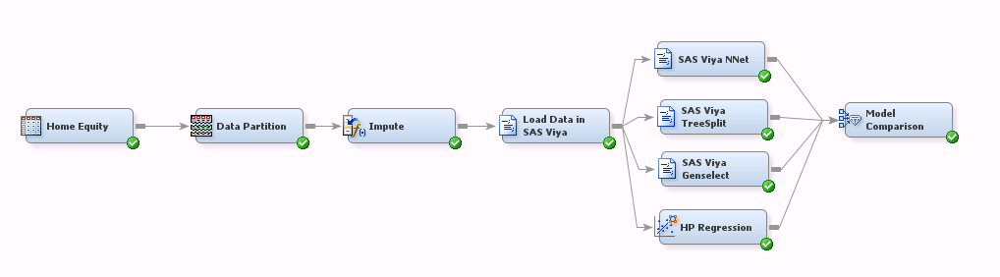

## Comparing Models from Enterprise Miner&trade; 14.1 and SAS&reg; Viya&trade;
This example demonstrates a simple process in which the standard home equity sample data set is used to train models using the HP Regression node in SAS 9.4 and the various modeling procs (NNET, TREESPLIT, and GENSELECT) available in SAS Viya.  An xml file of the corresponding Enterprise Miner diagram is attached for you to import into your project.

A complete description of this process can be found at https://communities.sas.com/.

***

##### Process Flow Diagram Comparing Models;

