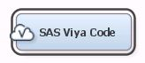

##SAS Viya Node in SAS Enterprise Miner 14.2+



These examples demonstrate how to use the new "SAS Viya" node in Enterprise Miner 14.2 and later to invoke analytics in SAS Viya from a SAS 9.4-based application like Enterprise Miner. This node serves as a template for the various steps involved in the SAS 9 <--> SAS Viya interaction and provides convenient macros to encapsulate much of the work of 
* managing the connection and CAS session, 
* preparing/transferring data,
* setting macro variables in the SAS Viya environment, 
* assessing models in SAS Viya, and 
* processing results.  

Each of the diagrams provided here can be imported into an Enterprise Miner project and executed, given the appropriate SAS Viya and CAS server host/port and logon information.  The code for each node is well documented to guide you through what is taking place at each step.

* **Viya-CompareModels** - demonstrates how models can be trained in SAS Viya and compared with models trained in Enterprise Miner

* **Viya-ParallelTraining** - demonstrates how multiple models can be trained in parallel in SAS Viya and ultimately compared in Enterprise Miner

* **Viya-ScoreSVM_in_EM** - demonstrates how a model trained in SAS Viya can be transferred back and scored in Enterprise Miner

* **Viya-Standalone** - demonstrates how this node can be used to simply invoke SAS Viya proc calls on data that already exists in CAS; since it is not using data known to the Enterprise Miner project it cannot be incorporated into a flow

These diagrams are expecting the following macro variables to be provided.  It is suggested that you define these in your Project Start Code (select the project in the navigation tree on the left and edit and run code in the Project Start Code property):

```
%let viyaHost=<SAS Viya server>;
%let viyaPort=<SAS Viya port>;
%let cashost =<CAS server>;
%let casport = <CAS server port>;
```

In each SAS Viya Code node you will need to provide the logon credentials (user name and encoded password).  You can generate an encoded password by running the following code in a program editor:

```
proc PWENCODE in="<your password>"; run;
```

Extensive documentation on the SAS Viya Code node, including descriptions of the available properties and macros, can be found in the Enterprise Miner 14.2 Reference Help.  Click on the Help Contents button on the toolbar (or select Contents in the Help menu) and on the Search tab type "Viya".
